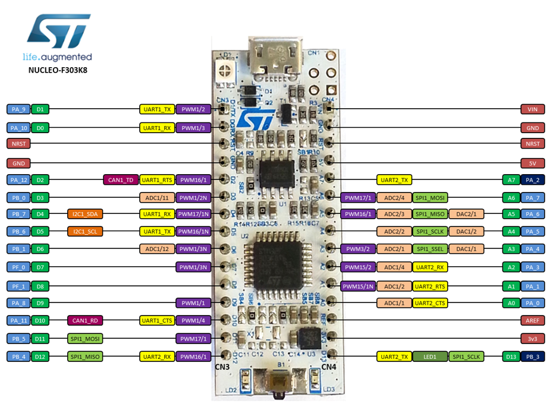

# Uart_sniffer
Úlohou je odchytávanie obojsmernej UART komunikácie medzi dvomi ľubovoľnými zariadeniami pomocou STM32. Dáta odchytávanej komunikácie budú následne zapísané na SD kartu pomocou dostupných knižníc. Pre zápis odchytených dát na SD kartu použijeme zbernicu SPI. Odchytené dáta budú zapísané vo formáte CSV. Na SD karte sa bude nachádzať súbor pre konfiguráciu UART periférii.
## Úlohy:
1.	UART komunikácie medzi dvomi ľubovoľnými zariadeniami
2.	Fyzické pripojenie STM32 k existujúcej UART komunikácii ako data sniffer
3.	Získanie dát z existujúcej komunikácie
4.	Zápis získaných dát na SD kartu pomocou zbernice SPI vo zvolenom formáte

## Potrebné súčiastky	
•	STM32

•	Jumper káble

•	SD karta / Micro SD karta + redukcia / Mini SD karta + redukcia

 
## Pripojenie zariadenia:

Pre správnu funkčnosť je potrebné pripojiť zariadenie podľa nasledujúcich inštrukcii:
Odpočúvaná linka č.1    		UART1 RX -> RX1 	pin PA10/D0
Odpočúvaná linka č.2    		UART2 RX -> RX2	pin PA3/A2

Je potrebná pamäť typu SD card/ SDcard mini + redukcia pre zápis zaznamenaných údajov. Je potrebné aby bola karta zasunutá v SD card module.
	
SD card module - SPI :  	SPI_SCK -> 	PA5/A4			Napájanie pre SD card module:
			SPI_MISO ->	PA6/A5				3v3 -> 3v3
			SPI_MOSI -> 	PA7/A6				GND -> GND
			SPI_CS ->	PB0/D3

## Uvedenie do prevádzky
Posledným krokom je pripojenie STM F303K8 k zdroju 5V, najlepšie pomocou microusb vstupu.
V prípade že pri inicializácii SD karty nastala chyba rozsvieti sa dióda LED3. V takom prípade je potrebné STM zariadenie odpojiť od napájania. Skontrolovať či je SD karta správne pripojená a následne proces pripojenia zopakovať.

## Programátorská priručka
Komunikácia s SD kartou a samotný zápis údajov je nakonfigurovaný pomocou periférii SPI a FATFS. Pre odchytávanie dát zo sériovej komunikácie sú použité dve periférie USART1 a USART2 v asynchrónnom režime. V neposlednom rade používame perifériu GPIO pre SPI_CS pin ako GPIO_output a pre LED3 / PB3 ako GPIO_output. 
Pre každú perifériu je vygenerovaná a prispôsobená dvojica súborov  _periéria .c/.h .
Prioritne bola použitá knižnica _LL a to pre USART a  GPIO, pre FATFS a SPI sme boli nútený použiť knižnicu _HAL a to z dôvodu že FATFS je vytvorená iba pre _HAL a používa niektoré prvky _HAL knižnice pre SPI.
Vygenerované súbory pre FATFS boli doplnené a upravené za účelom komunikácie s SD kartou pomocou SPI a nie pôvodne SDIO (konkrétne obslužné knižnice fatfs_sd .c /.h. ).

V súbore main.c si definujeme niekoľko potrebných premenných pre prácu so súborom a s prijatými dátami.  Nami vytvorená funkcia "parsestr" slúži pre vyčítanie informácii z konfiguračného súboru z SD karty s názvom „uartinit.txt“. Tento súbor obsahuje informácie o sledovanej komunikácii. Pre správne odchytávanie komunikácie je nutné informácie v tomto súbore prispôsobiť. 
Následne sú inicializované periférie USART pomocou upravených generovaných funkcii.
USART odchytené dáta spracuje pomocou prerušení a obslužných funkcii pre prerušenie. Následne sú dáta presunuté do bufferu až pokiaľ nepríde ukončovací znak ktorý väčšinou ukončuje nejakú komunikáciu. V prípade že je takýto znak obdržaný, nastaví sa flag pre zápis údajov a následne sú dáta zapísané na SD kartu v CSV formáte do súboru „sniffer.txt“ .
